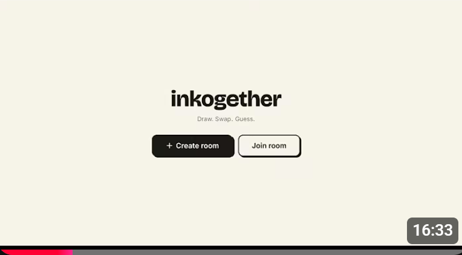

# Inkogether

Inkogether is a real-time multiplayer drawing and guessing game built with React, Socket.IO, and Node.js.

Players split into two teams, draw from team-specific prompts, swap drawings, and guess the opposing team prompt.

[](https://youtu.be/aFS3hRwST7o)

## Highlights

- Real-time gameplay with Socket.IO
- Multi-room lobby flow (create/join)
- Team-based draw and guess phases
- AI-assisted prompt generation and guess similarity scoring (Gemini)
- Horizontally scalable backend with 3 replicas
- Redis-backed room assignment across replicas

## Architecture

- Client: React + Vite
- API/WebSocket: Express + Socket.IO
- Scaling: 3 backend replicas behind Nginx
- Shared coordination: Redis key-value mapping for room ownership

### Distributed room routing

 - Nginx: Reverse proxy and load balancer (configured with `least_conn`) used as the public entrypoint and initial load distributor.
 - Redis is used for the simple room ownership mapping described below.
 - Routing all players in the same room to the same server keeps shared room state local, which reduces latency and avoids the complexity of syncing in-memory data across replicas.

1. Room is created on a replica (`app1`, `app2`, or `app3`).
2. Backend stores `room:owner:<roomId> -> <appName>` in Redis with TTL.
3. Join flow calls `/api/assign/:roomId` through Nginx.
4. Assigner returns the owning replica URL.
5. Client reconnects Socket.IO to the correct replica.

## Repository structure

```text
client/   React frontend (Vite)
server/   Express + Socket.IO backend, Redis, Docker, Nginx
```

## Prerequisites

- Node.js 20+ (22 recommended)
- npm 10+
- Docker Desktop (for distributed mode)
- Optional: Google Gemini API key for AI prompt/semantic matching

## Quick start (recommended: distributed mode)

Run the 3-replica backend stack with Redis and Nginx:

```bash
cd server
docker compose up --build
```

Services:

- Nginx entrypoint: http://localhost:3000
- App replicas: http://localhost:3001, http://localhost:3002, http://localhost:3003
- Redis: localhost:6379

Start the frontend in another terminal:

```bash
cd client
npm install
npm run dev
```

Open the client URL shown by Vite (usually http://localhost:5173).

## Environment variables (backend)

| Variable | Required | Description |
|---|---|---|
| `PORT` | Yes | Port for the current backend instance |
| `APP_NAME` | Yes | Replica identity (for example `app1`) |
| `REDIS_URL` | Yes | Redis connection string |
| `REPLICA_NAMES` | Yes | Comma-separated replica names |
| `REPLICA_PUBLIC_ENDPOINTS` | Yes | Comma-separated public base URLs matching names |
| `GEMINI_API_KEY` | Optional | Enables Gemini-based prompt generation/similarity |

## Backend API

- `GET /api/room/:roomId` - returns room snapshot for hydration
- `GET /api/assign/:roomId` - returns owning replica URL for room join routing

## Core socket events

- Room: `room:create`, `room:join`, `room:team_toggle`, `room:ready_toggle`, `room:replay`, `room:end`
- Game: `game:start`, `game:draw:send`, `game:guess:send`, `game:end`
- Chat: `message-lobby:send`, `message-team:send`

## Production notes

- Keep Redis available; it is required for room ownership lookups and Socket.IO adapter fanout.
- Configure CORS and origin restrictions before production deployment.
- Use persistent logging/monitoring for replicas and Redis.
- Consider rate limiting and input validation on all user events.

> [!NOTE]
> Note on Audio: The background music is not included in this repository to comply with Pixabay's redistribution license.
> To run the game locally with sound, please download track called Game Gaming Music of HitsLab from Pixabay and save it as `background-music.mp3` inside the `assets/audio/` folder.

## Troubleshooting

- Join returns "room not found": ensure replica names and public endpoint lists are aligned in order.
- Frontend cannot connect: verify backend/Nginx is running on `http://localhost:3000`.
- Redis errors: confirm Redis is reachable at `REDIS_URL`.
- AI features unavailable: check `GEMINI_API_KEY` and external API access.
